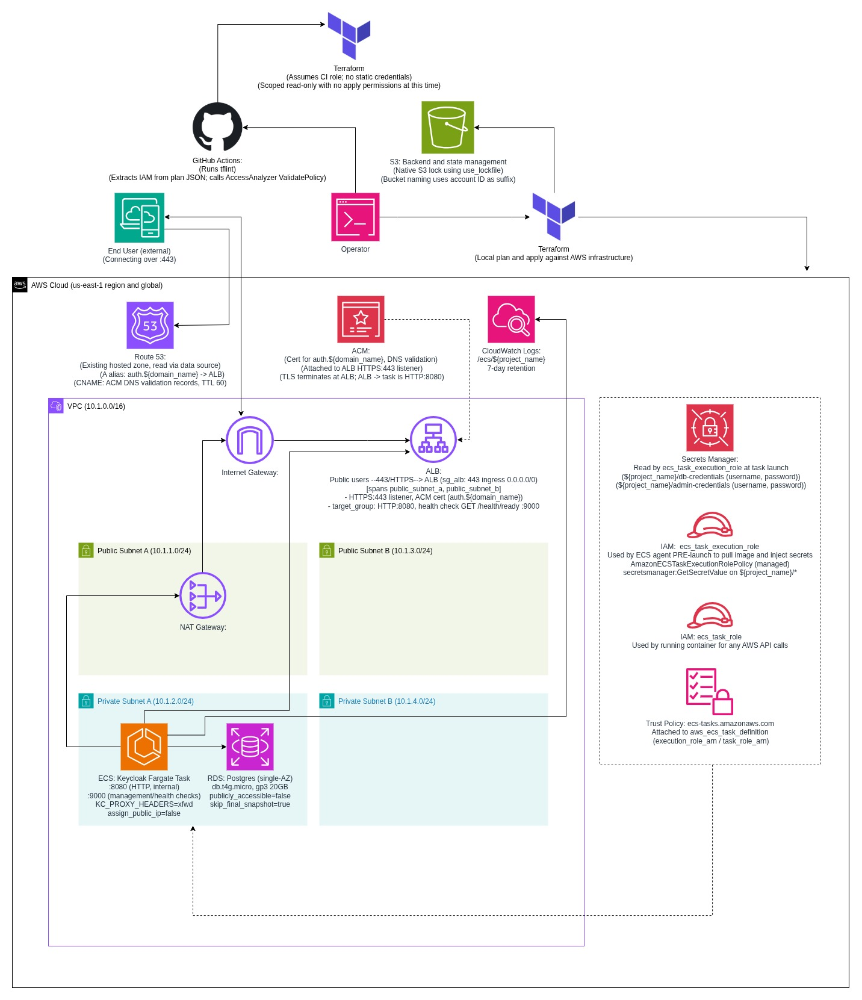

# Keycloak on ECS Fargate with Terraform

This project deploys Keycloak on AWS ECS Fargate, fronted by an Application Load Balancer with ACM-managed TLS, backed by RDS Postgres, with secrets managed via AWS Secrets Manager. The stack (networking, compute, database, IAM, CI/CD) is provisioned with Terraform using only AWS provider resources, and no community modules, so every architectural decision stays explicit.

## Architecture



- **Compute**: ECS Fargate running the Keycloak container. No EC2 instances to patch or manage.
- **Networking**: dedicated VPC with public/private subnets across two AZs. NAT gateway for outbound internet access, required since Keycloak's identity federation needs to reach external providers.
- **Load balancing**: ALB with an HTTPS listener (ACM certificate, DNS validated) and HTTP to HTTPS redirect. Target group health check hits Keycloak's dedicated management port.
- **Database**: RDS Postgres, single-AZ, `db.t4g.micro`. Sized for a lab, not production, and documented as such.
- **Secrets**: AWS Secrets Manager for DB credentials and Keycloak admin credentials, injected into the ECS task via the `secrets` block rather than baked into the task definition or image.
- **DNS**: Route 53 alias record pointing at the ALB. Alias, not CNAME, since it resolves cleanly and lets Route 53 route directly to the load balancer without an extra DNS lookup.
- **State management**: S3 backend with native S3 locking (`use_lockfile`, Terraform 1.11+) instead of DynamoDB. State bucket named with an account ID suffix via `data.aws_caller_identity`, for deterministic, reconstructable naming.
- **CI/CD**: GitHub Actions, authenticated via OIDC, no long-lived AWS credentials in CI. Two jobs are run:
  - `terraform`: format check, validate, TFLint with the AWS ruleset plugin
  - `iam-policy-check`: runs a real `terraform plan`, extracts every IAM policy the plan would create, validates each one against AWS IAM Access Analyzer's `ValidatePolicy` API before the PR can merge

## IAM Role Design

Two distinct roles back the ECS task. This is a commonly conflated distinction worth being explicit about:
- **Execution role** (`ecs_task_execution_role`): used by the ECS agent itself, before the container starts, to pull the image and inject secrets from Secrets Manager
- **Task role** (`ecs_task_role`): used by the running container for any AWS API calls it makes at runtime

A separate, dedicated IAM role authenticates GitHub Actions via OIDC, scoped only to this repository (`repo:orionilloc/keycloak-ecs-fargate:*`) with read-only permissions sufficient for `terraform plan`. No apply-level permissions are granted to CI. This role is defined in `bootstrap-keycloak-ecs-fargate/oidc.tf`, applied locally and separately from the main project's state, so it isn't affected by tearing down the root infrastructure.

## Prerequisites

1. AWS account and CLI, configured with a profile that has sufficient permissions to create the resources in this repo
2. Terraform >= 1.11.0
3. A registered domain with its public hosted zone already managed in Route 53. This is a prerequisite, not something Terraform creates. The `data "aws_route53_zone"` lookup expects it to already exist.
4. (For CI) A GitHub Actions OIDC IAM role. See `bootstrap-keycloak-ecs-fargate/` for how this project's role was created.

## Deployment

1. Bootstrap remote state (one-time, if not already done):
```bash
   cd bootstrap-keycloak-ecs-fargate
   terraform init
   terraform apply
```

2. Generate the backend config:
```bash
   ./scripts/gen-backend-config.sh
```

3. Initialize and deploy the main stack:
```bash
   terraform init -backend-config=backend.hcl
   terraform plan -var="domain_name=yourdomain.com"
   terraform apply -var="domain_name=yourdomain.com"
```

4. Access Keycloak at `https://auth.yourdomain.com`. Initial admin credentials are in Secrets Manager under `<project_name>/admin-credentials`.

## Known Limitations (Deliberate, for a Lab)

- Single-AZ RDS, no automated backups beyond RDS defaults. Not production-durable by design.
- `skip_final_snapshot = true`. Teardown-optimized, not appropriate outside a lab context.
- Bootstrap admin account is left active rather than disabled, for teardown/rebuild convenience.
- No WAF, no standing IAM Access Analyzer resource, no centralized logging at this time.
